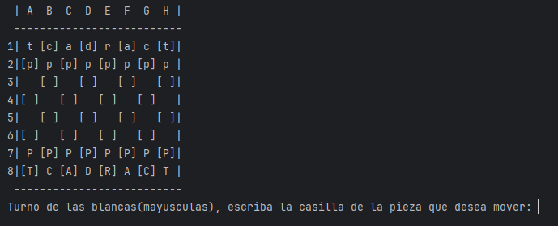
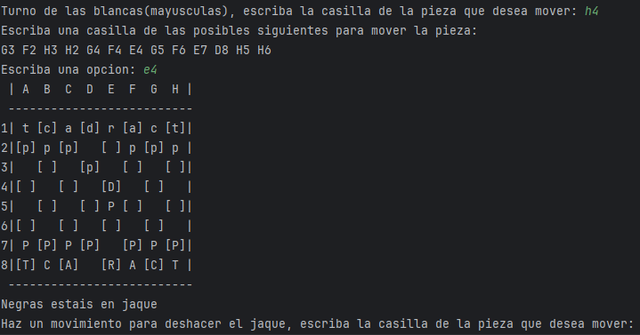
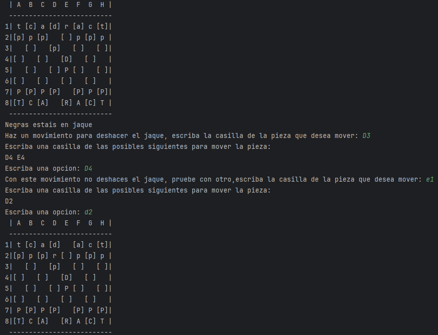
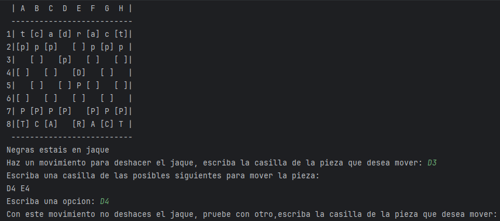
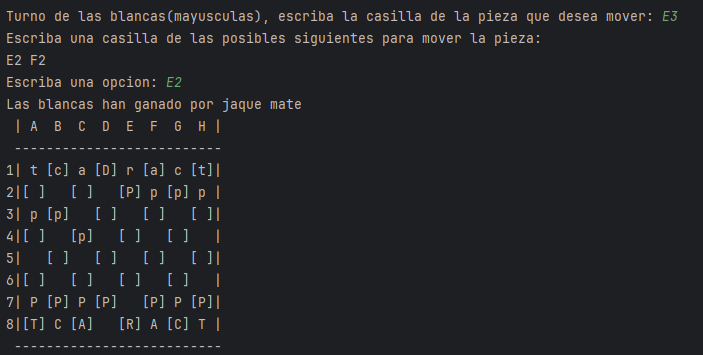

# Ajedrez por Consola

¡Bienvenido a mi proyecto de Ajedrez por Consola! 🏁 Este juego te permite disfrutar de partidas de ajedrez directamente desde la consola, con todas las reglas del ajedrez estándar implementadas.

Próxima version: Ajedrez completamente funcional con JavaFX

## 📸 Capturas de Pantalla

### Inicio de la Partida


### Jaque


### Deshacer el Jaque


### No Deshacer el Jaque


### Jaque Mate


## 🚀 Características

- **Reglas estándar de ajedrez**: Movimiento completo de piezas, enroque, jaques, jaque mate.
- **Interfaz en consola**: Una experiencia sencilla y directa.
- **Gestión de errores**: Mensajes claros para movimientos ilegales.

## ⚙️ Cómo Ejecutar

1. **Clona este repositorio**:
    ```bash
    git clone https://github.com/CarlosHernandezCR/Ajedrez.git
    ```
2. **Accede al directorio del proyecto**:
    ```bash
    cd Ajedrez/src/ajedrez
    ```
3. **Compila y ejecuta el proyecto**:
    - Si usas **Java**:
      ```bash
      javac ajedrez/*.java piezas/*.java
      java ajedrez.Juego
      ```

## 💡 Cómo Jugar

1. Sigue las instrucciones que se muestran en consola.
2. Introduce movimientos en el formato adecuado (Elija primero la pieza a mover, mire que movimientos tiene disponibles, escriba la casilla a la que desea ir).
3. Responde a las situaciones estratégicas como jaques o jaque mate.

## 🤝 Contribuciones

¡Las contribuciones son bienvenidas! Si encuentras algún error o tienes una idea para mejorar el juego, no dudes en abrir un **issue** o enviar un **pull request**.
